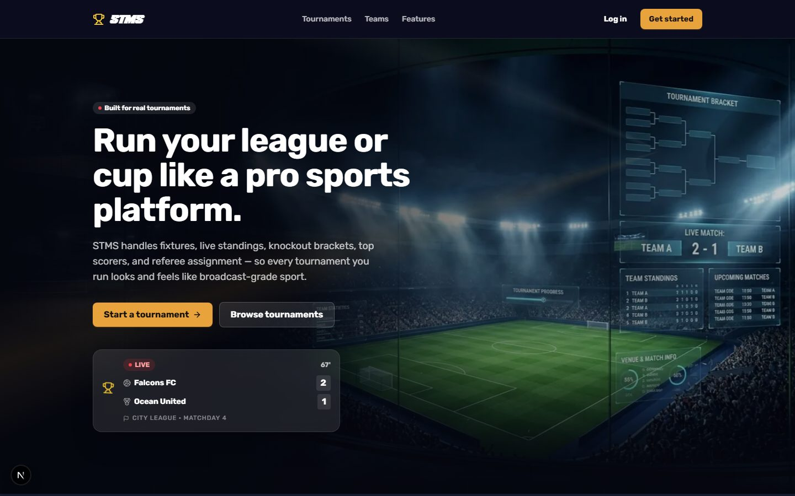
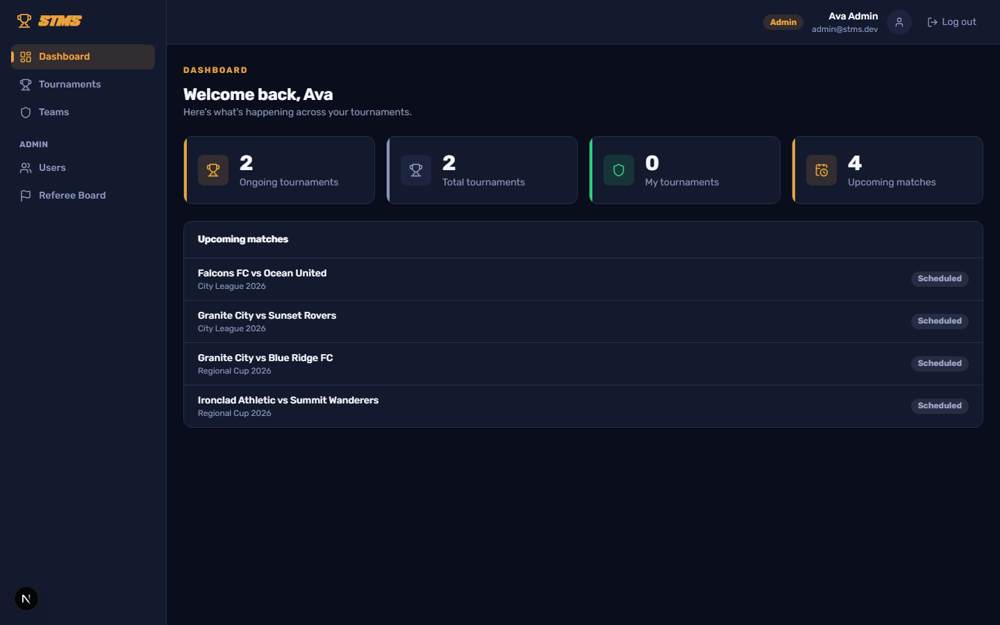
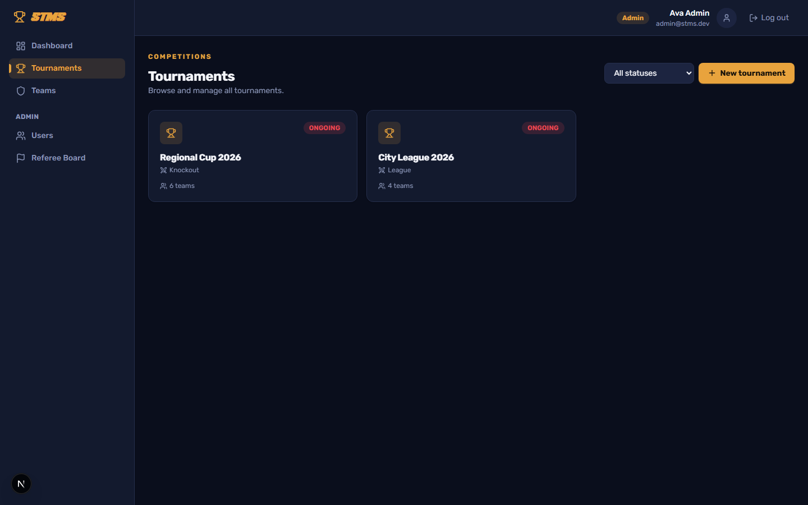
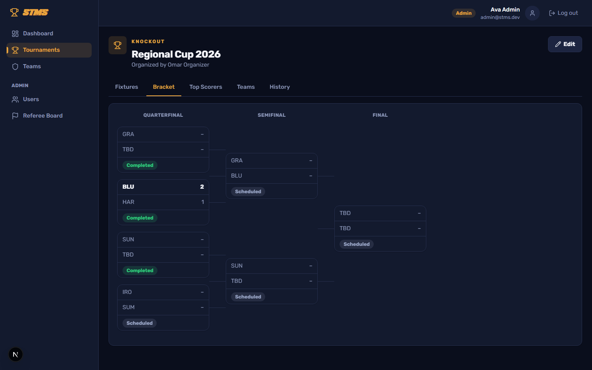
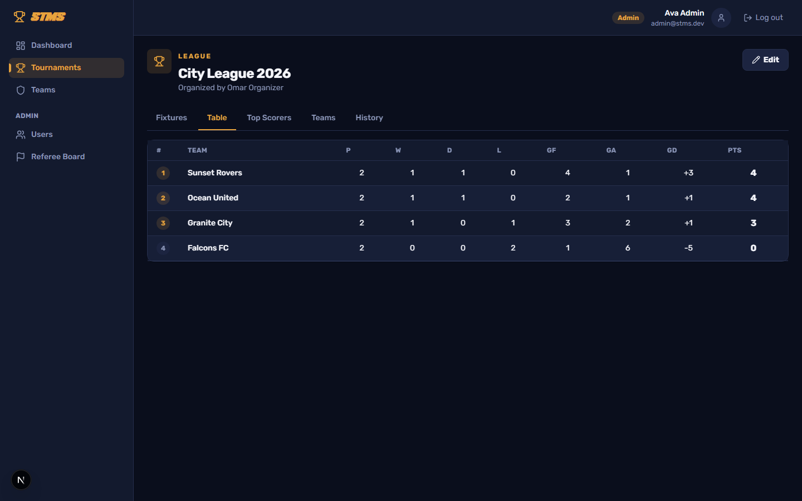
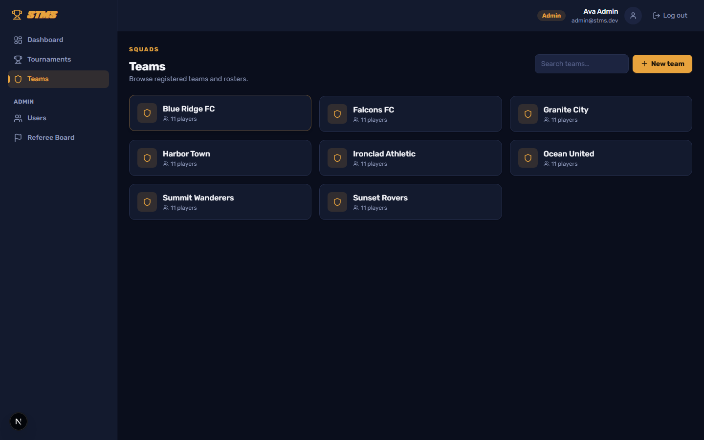
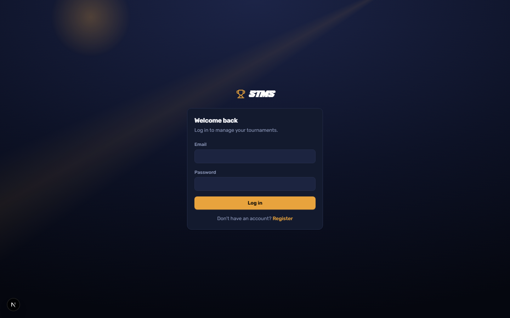
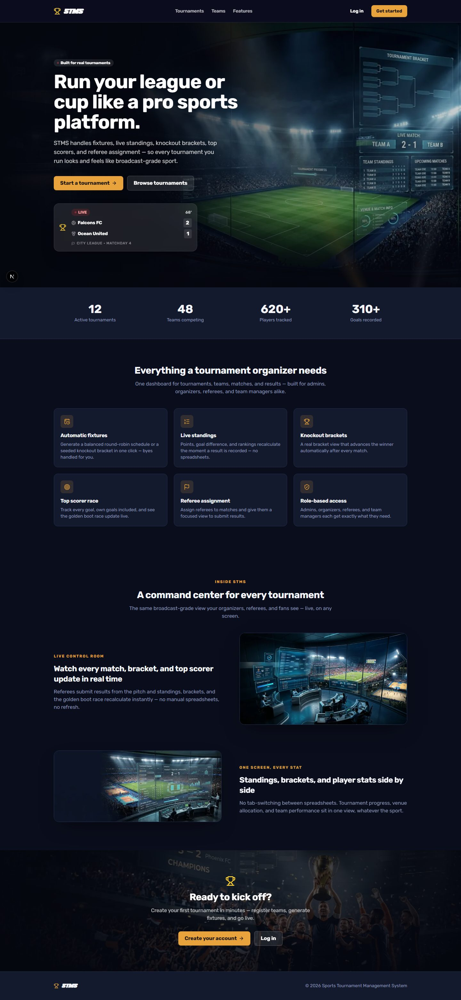

<div align="center">



# STMS — Sports Tournament Management System

Run a league or knockout cup the way a broadcaster would: fixtures, live standings, brackets, top scorers, and referee assignment in one dashboard.

[](https://nextjs.org)
[](https://react.dev)
[](https://www.typescriptlang.org)
[](https://www.prisma.io)
[](https://tailwindcss.com)
[](https://vitest.dev)

</div>

---

## Overview

STMS is a full-stack tournament management platform for organizers running a league or knockout competition. Create a tournament, register teams and players, auto-generate fixtures, and let the app do the rest — standings recalculate the moment a referee submits a result, the bracket advances winners automatically, and the top-scorer race updates live.

## Screenshots

<table>
<tr>
<td width="50%">

**Dashboard**


</td>
<td width="50%">

**Tournaments**


</td>
</tr>
<tr>
<td width="50%">

**Knockout bracket**


</td>
<td width="50%">

**League table**


</td>
</tr>
<tr>
<td width="50%">

**Teams**


</td>
<td width="50%">

**Login**


</td>
</tr>
</table>

<details>
<summary>Full landing page</summary>



</details>

## Features

- **Automatic fixtures** — generate a balanced round-robin schedule or a seeded knockout bracket in one click, byes handled for you.
- **Live standings** — points, goal difference, and rankings recalculate the instant a result is recorded.
- **Knockout brackets** — a real bracket view that advances the winner automatically after every match.
- **Top scorer race** — every goal (own goals included) tracked toward a live golden-boot leaderboard.
- **Referee assignment** — assign referees to matches and give them a focused view to submit results.
- **Role-based access control** — Admins, Organizers, Referees, and Team Managers each see exactly what they need.

## Roles & permissions

| Role | Can do |
|---|---|
| **Admin** | Full access — manage users, referees, tournaments, and teams |
| **Organizer** | Create and manage tournaments, generate fixtures, assign referees |
| **Referee** | View assigned matches and submit results |
| **Team Manager** | Manage their own team's roster |

## Tech stack

| Layer | Choice |
|---|---|
| Framework | [Next.js 16](https://nextjs.org) (App Router) + React 19 |
| Language | TypeScript |
| Styling | Tailwind CSS 4 |
| Database | SQLite via [Prisma ORM](https://www.prisma.io) |
| Auth | JWT sessions (`jose`), `bcryptjs` password hashing, custom `proxy.ts` route guard |
| Validation | Zod |
| Testing | Vitest + React Testing Library |
| Icons | lucide-react |

## Getting started

### Prerequisites

- Node.js 20+
- npm

### Setup

```bash
# 1. Install dependencies
npm install

# 2. Configure environment
cp .env.example .env
# edit .env and set a real JWT_SECRET

# 3. Create the database and seed demo data
npm run db:push
npm run db:seed

# 4. Start the dev server
npm run dev
```

Open [http://localhost:3000](http://localhost:3000) — the marketing home page is public; sign in or register to reach the dashboard.

### Demo accounts

Seeded by `npm run db:seed` (password for all: `password123`):

| Role | Email |
|---|---|
| Admin | `admin@stms.dev` |
| Organizer | `organizer@stms.dev` |
| Referee | `referee1@stms.dev` |
| Team Manager | `manager1@stms.dev` |

## Scripts

| Command | Description |
|---|---|
| `npm run dev` | Start the dev server (Turbopack) |
| `npm run build` | Production build |
| `npm run start` | Start the production server |
| `npm run lint` | Lint the codebase |
| `npm run typecheck` | Type-check with `tsc --noEmit` |
| `npm test` | Run the Vitest suite |
| `npm run db:push` | Push the Prisma schema to the database |
| `npm run db:migrate` | Create/apply a Prisma migration |
| `npm run db:seed` | Seed demo tournaments, teams, and users |
| `npm run db:studio` | Open Prisma Studio |

## Project structure

```
src/
  app/                # Next.js App Router routes
    (auth)/            # Login / register (public)
    (main)/            # Dashboard, tournaments, teams, admin (protected)
    api/                # Route handlers
  components/
    marketing/         # Landing page sections
    tournaments/        # Bracket, league table, match card, etc.
    layout/              # Sidebar, top nav, app shell
    ui/                  # Shared design-system primitives
  lib/                 # Auth, RBAC, session context, fonts, standings logic
  proxy.ts             # Route-level auth/role guard (replaces middleware)
prisma/
  schema.prisma        # Data model
  seed.ts              # Demo data
```

## License

Private project — not currently licensed for reuse.
